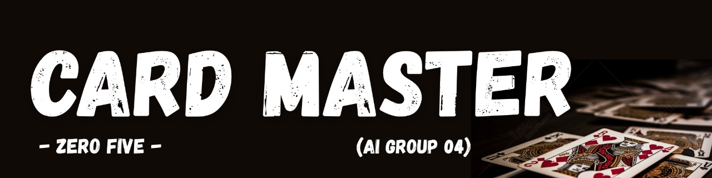
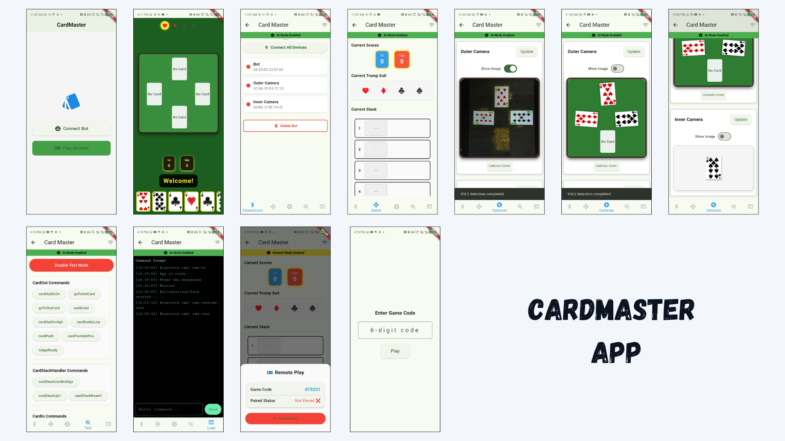
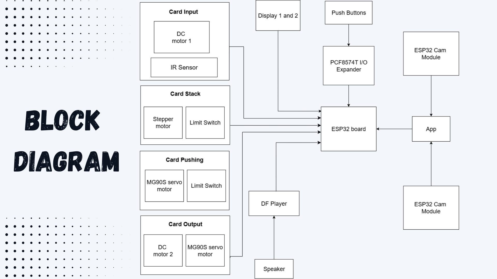
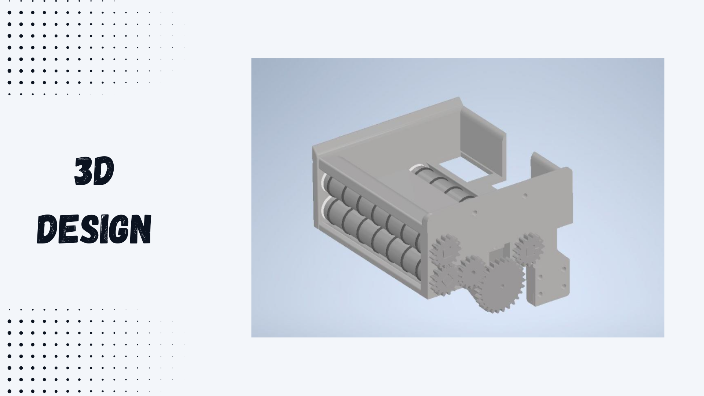
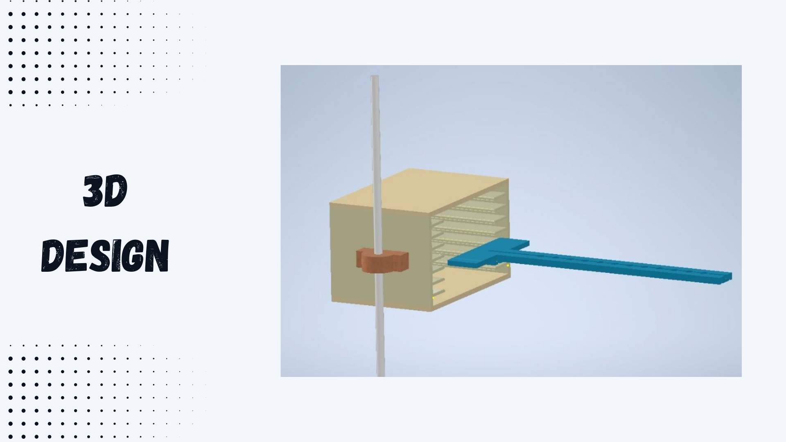
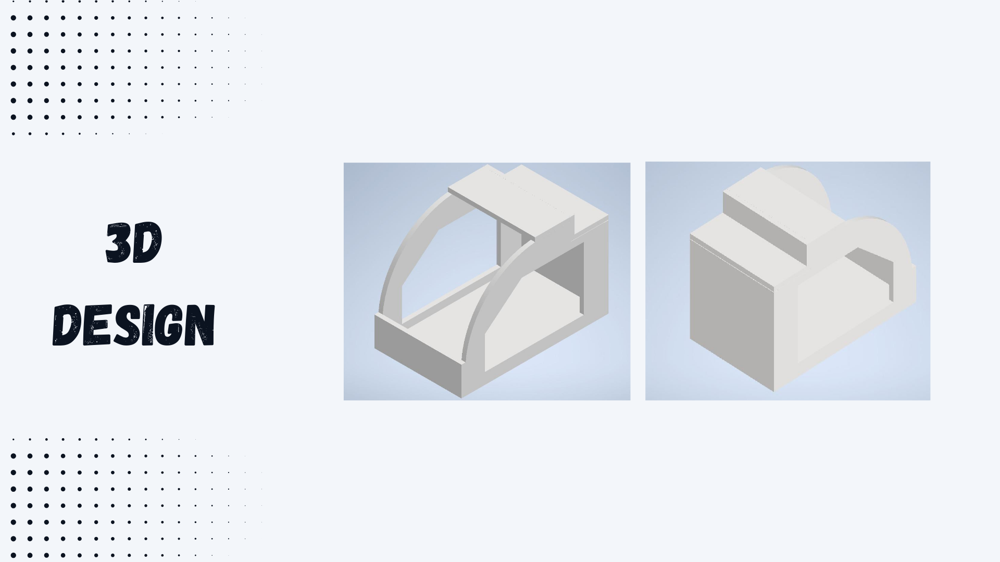
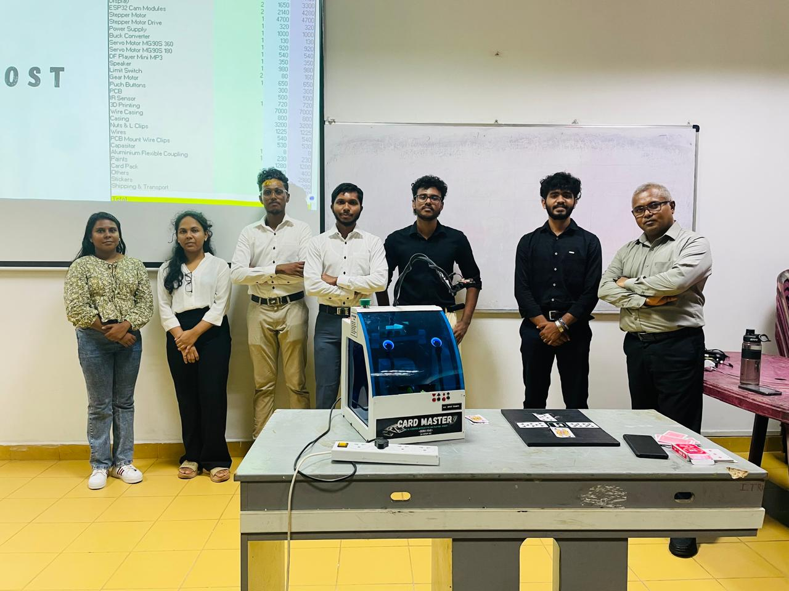

  

# 🎴 CardMaster – AI-Powered Omi Playing Robot

**CardMaster** is an intelligent robotic system designed to play the traditional Sri Lankan card game **Omi** as one of four players.  
It combines **computer vision**, **machine learning**, **decision-making algorithms**, and **mechanical systems** to interact with physical cards in real-time while engaging human players.

> This project was developed as part of the **CM1900 Intelligent Machines Inspirational Project**  
> Faculty of Information Technology, University of Moratuwa.

---

## 🚀 Features

- 🔹 **Card Insert & Storage Mechanism** – Smooth motorized slots with 8-card holder.  
- 🔹 **Card Recognition** – Internal and external ESP32-CAM modules powered by a YOLO-based detection model.  
- 🔹 **Strategic Decision Making** – Custom-trained reinforcement learning agent with ~85% win rate in simulations.  
- 🔹 **Card Deployment** – Stepper + DC motors for precise card playing.  
- 🔹 **Interactive Design** – Animated digital eyes & audio feedback for friendly interaction.  
- 🔹 **Remote Play** – A mobile/desktop app allows a remote player to join as the 4th player.  

---

## 🎯 Aim

To design and develop an **AI-powered interactive robot** capable of:  
- Recognizing cards using vision systems.  
- Strategically selecting the best moves with decision-making algorithms.  
- Physically playing cards using electromechanical mechanisms.  
- Enabling **human-robot social interaction** in traditional games.  

---

## 🛠️ Hardware Components

- **ESP32 DevKit V1** – Main controller.  
- **ESP32-CAM Modules** – For card recognition (internal & external cameras).  
- **Motors & Drivers** – Stepper motor + A4988, Servo motors (180° & 360°), DC motors, L298N driver.  
- **Displays** – Dual DM0049 round TFT LCDs for robot eyes.  
- **DFPlayer Mini + 5W Speaker** – Audio feedback system.  
- **TCRT5000 IR Sensor, Limit Switch, PCF8574 I/O Expander** – Input and sensing modules.  
- **12V 5A SMPS & LM2596 Buck Converter** – Power supply system.  

---

## 💻 Software Stack

- **Arduino IDE** – Microcontroller programming.  
- **EasyEDA** – PCB and schematic design.  
- **Inventor** – Mechanical design and 3D modeling.  
- **Python + PyTorch** – AI agent training.  
- **Roboflow + Kaggle** – Dataset preparation & training.  
- **Flutter + TFLite + ONNX Runtime** – Mobile app for detection, prediction, and hardware control.  

---

## 📱 Mobile App

To power the entire system, a **Flutter application** was built with **TensorFlow Lite** and **ONNX Runtime** for running the models directly on-device.  
The app serves as the **central controller** for all three connected devices:

- 🤖 **Bot** – Handles motor actions and card output.  
- 📷 **Inner Camera** – Recognizes the robot’s own cards.  
- 📷 **Outer Camera** – Monitors the gameplay table.  

### 🔗 Connectivity
- Each device is connected to the app through **separate Bluetooth links**.  
- The app manages synchronization of **hardware actions** and **camera detections** in real time.  

### 🎮 Modes
1. **AI Mode**  
   - The bot autonomously predicts the best card using past game data and the current desk state.  
   - All actions (detection, selection, deployment) are executed automatically.  

2. **Remote Mode**  
   - A remote player can connect to the app using a **pairing code** through the internet.  
   - The player interacts with a **graphical Omi environment** inside the app.  
   - The robot mirrors the player’s actions physically by throwing the selected card.  

### 📸 The App

---

## 📊 System Overview

### Block Diagram  

### 3D Model  
  
  
  

---

## 🧪 Testing & Implementation Highlights

- 📷 **Card Detection Model** – Trained on 10k+ annotated images, achieving 90%+ accuracy.  
- 🃏 **Card Selection Model** – Reinforcement learning agent trained for 200k episodes with self-play.  
- ⚙️ **Improved Mechanisms** – Redesigned stack, reliable PCB, L298N motor drivers, and enhanced displays.  
- 🔊 **Audio & Interaction** – Transitioned from buzzer → MP3 + Speaker for expressive sounds.  

---

## 🔮 Future Development

- Integration with **Raspberry Pi** for more advanced image processing and ML inference.  
- **Voice-based interaction** for enhanced engagement.  
- **Online connectivity** for remote matches & statistics logging.  
- Expansion to other **multiplayer board/card games**.  

---

## 👨‍💻 Team Zero Five

- **J.V. Ransika** – Displays & Card Selection Model  
- **L.M.T.Udana** – Cameras, App Development & Card Detection Model  
- **R.M.S.C. Rathnayaka** – Physical Design, 3D Modeling & Stack Mechanism  
- **M.G.R.S. Nawarathna** – Sound Output, Servo Systems & I/O Expander  
- **D.M.A.I. Dissanayaka** – PCB Design & DC Motor Systems  

Supervisor: **Mr. B. H. Sudantha**

---

## 📸 Evaluation Day

  

---

## 📚 References

- [Playing Cards Dataset – Roboflow](https://universe.roboflow.com/joshuas-workspace/playing-cards-9gfac)  
- [Ultralytics YOLO11](https://docs.ultralytics.com/models/yolo11/)  
- [Kaggle Platform](https://kaggle.com)  

---